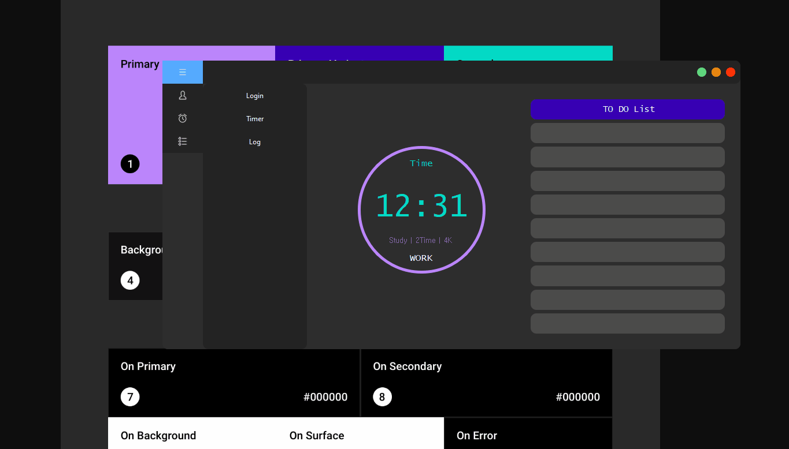

# Pomordor
        
 
 
 
## 🚀Introduce Pomordor

### Pomodoro Timer

- Edit...
- OS : Windows, Linux, Mac, Android 
 
## 👏How to Contribute
- Edit..
   
## 📋 How to Build 
- Edit 
-  
- 
  
## BLOG 
- [Kiseop Kim](https://blog.naver.com/kiseop91)  
CLO3D Software Engineer 
   

## Document 
- Edit..
- -
